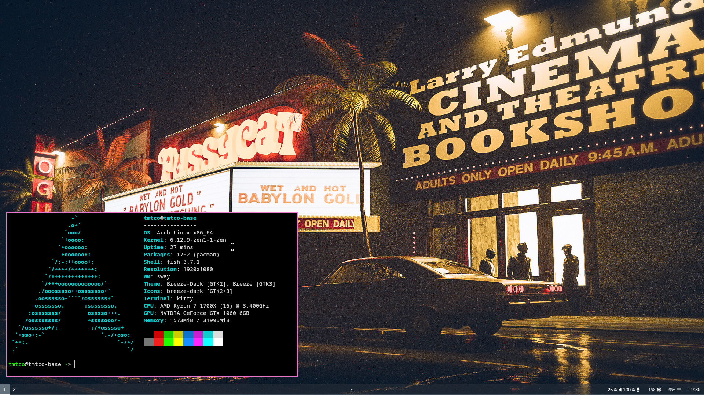

# .dotfiles
**Install packages with pacman:**

    pacman -S - < packages.txt
**Copy config files**

    cp -r .config/* ~/.config/
**Copy scripts:**

    cp -r scripts/* /usr/local/bin/

*(or anywhere in $PATH)*
**Make scripts executable:**

    chmod +x /usr/local/bin/powermenu
    chmod +x /usr/local/bin/screenshot
    chmod +x /usr/local/bin/rofi-sound-output-chooser
    chmod +x ~/.config/rofi/cliphist-rofi-img
**Set a background**
Get a background to your liking and place it in ~/Pictures/bg.png or change sway config to match your file name.

**Screenshot**

